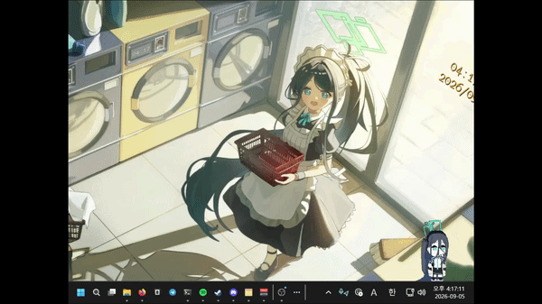
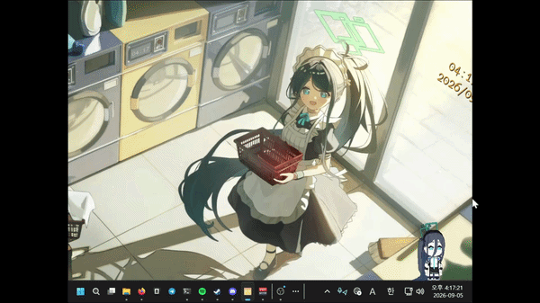
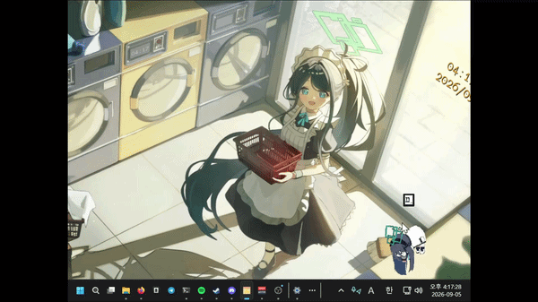

# Aris - Windows

## 갤러리

### 잡기


### 평상시


### 던지기


## 주요 기능

- **항상 위 투명 윈도우** - 테두리/타이틀바 없는 200x250 창에서 동작 (`Assets/Script/WindowsAPI/TransparentApp.cs`, `ProjectSettings.asset`)
- **자연스러운 행동** - Idle / Walking (5~10초 랜덤 이동) / Pick(잡기) / Fall(낙하) / EyesClose(깜빡임) (`Assets/Animator/Aris/Aris.controller`, `Assets/Script/Data/SchedulerData.cs`)
- **드래그 & 물리** - 좌클릭으로 잡고 이동, 놓으면 중력과 관성으로 낙하, 작업표시줄에 착지 (`Assets/Script/MoveManager.cs`)
- **말풍선 대화** - 타이프라이터 효과로 한 글자씩 출력, 화면 너비에 맞춰 자동 줄바꿈 (`Assets/Script/DialogueManager.cs`, `Assets/Font/GmarketSans*.ttf`)
- **우클릭 메뉴** - 닫기 / 행동 멈춤·시작 / 종료 / 모니터 이동 (`Assets/Script/MenuManager.cs`, `Assets/Prefab/Button.prefab`)
- **할로우 & 표정** - halo 바운스 애니메이션, 얼굴 스프라이트 교체 (`Assets/Sprite/Airs/`)

## 기술 스택

| 항목 | 값 | 비고 |
|---|---|---|
| Unity | 2022.3.45f1 | `ProjectSettings/ProjectVersion.txt` |
| Render Pipeline | Built-in (Forward) | `GraphicsSettings.asset` |
| Language | C# 9.0 / .NET Standard 2.1 | `Assembly-CSharp.csproj` |
| UI | UGUI + TextMeshPro 3.0.6 | `Packages/manifest.json` |
| Native | Win32 Layered Window (user32.dll) | `TransparentApp.cs` |
| 폰트 | GmarketSans TTF | `Assets/Font/` |

## 프로젝트 구조

```
Aris_/
├─ Assets/
│  ├─ Animator/Aris/        # Aris.controller, idle/walk/Pick/Fall/EyesClose.anim, halo.anim
│  │            └─ UI/      # SpawnAnimationLeft/Right.anim (메뉴 등장)
│  ├─ Font/                 # GmarketSansTTFBold/Light/Medium.ttf
│  ├─ Prefab/               # Button.prefab
│  ├─ Scenes/               # SampleScene.unity (+ LightingData.asset)
│  ├─ Script/
│  │  ├─ Data/              # SchedulerData.cs, dialogueData.cs
│  │  ├─ WindowsAPI/        # TransparentApp.cs, SystemTray.cs
│  │  └─ MoveManager.cs, SchedulerManager.cs, MenuManager.cs, DialogueManager.cs 등
│  ├─ Sprite/Airs/          # idle, walk, Pick, Fall, halo 등
│  └─ TextMesh Pro/
├─ Packages/manifest.json
├─ ProjectSettings/
├─ docs/images/demo.gif     # 더미 자리
└─ README.md, LICENSE
```

## 시작하기

### 요구사항

- Unity Hub + Unity 2022.3.45f1
- Windows 10/11

### 에디터에서 실행

1. Unity Hub에서 `Aris_` 폴더 Open
2. `Assets/Scenes/SampleScene.unity` 열기
3. Play 버튼
   - 참고: 에디터에서는 투명 효과가 적용되지 않습니다 (`TransparentApp.cs: if(Application.isEditor) return`)
   - 드래그 낙하 물리도 빌드에서만 동작합니다

### 빌드로 실행

1. Unity 메뉴 `File > Build Settings`
2. `Scenes In Build`에 `Assets/Scenes/SampleScene.unity` 추가
   - 주의: 현재 `ProjectSettings/EditorBuildSettings.asset`이 비어있으면 빈 씬으로 빌드되어 검은 화면만 나옵니다. 반드시 씬을 추가하세요.
3. Platform: `PC, Mac & Linux Standalone` / Target: `Windows` / Architecture: `x86_64`
4. `Build And Run` 클릭
5. 빌드된 창은 0.5초 뒤 200x250으로 리사이즈되어 화면 우하단에 배치되며, 배경은 투명 처리됩니다

## 다운로드

| 버전 | 파일 | 설명 |
|---|---|---|
| v0.0.2 | `Aris_.zip` | 최초 빌드 (`ProjectSettings.asset bundleVersion: 0.0.2`) |

## 크레딧

- 캐릭터: 블루아카이브 - 아리스
- 폰트: GmarketSans
- 아이콘/스프라이트: `Assets/Sprite/` 참고
- 투명 윈도우: Win32 `WS_EX_LAYERED` + `SetLayeredWindowAttributes`
